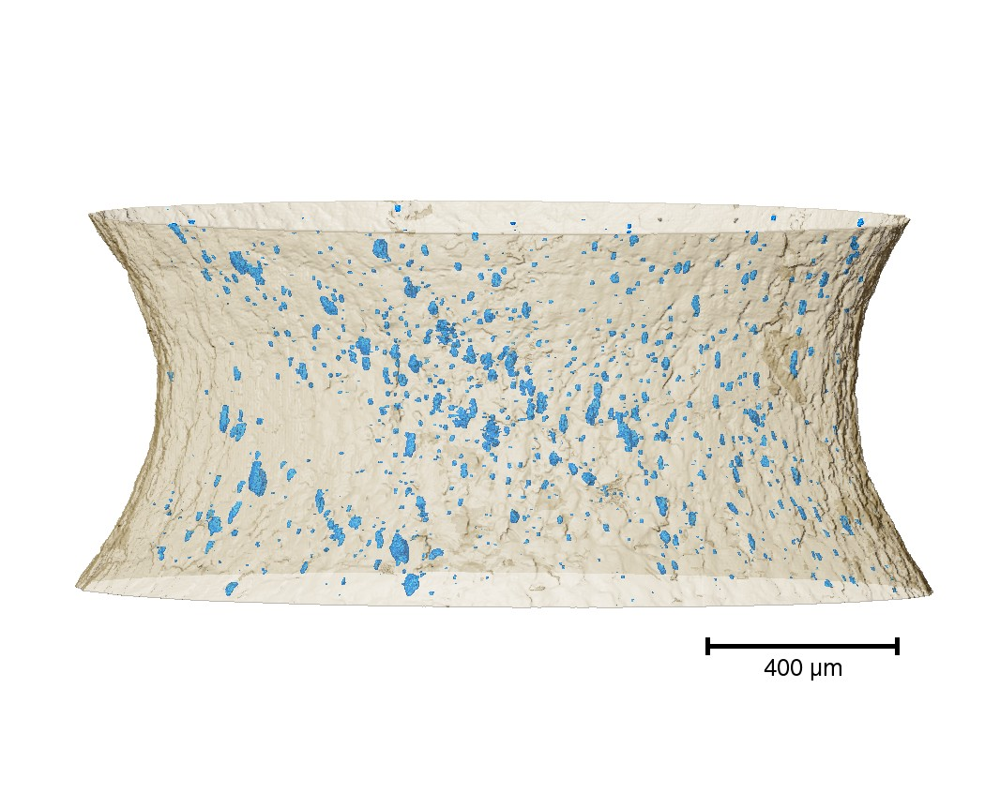

# Reconstruction of ESRF data: Suleyman Karabal (UoM), Supervisor: Phil Withers (UoM).

## Project

The purpose of the experiment is to understand ductile fracture micromechanisms of SA508 Grade 3 steel. Ductile fracture takes place by nucleation, growth and coalescence of voids. Voids are generally nucleated from inclusions or second phase particles by different nucleation mechanisms. With increasing strain, nucleated voids grow as a function of the stress state around voids. Finally, voids coalesce with one another to form a micro-crack, then we see a sudden failure of material. I specifically focus on how growth and coalescence mechanisms occur in different stress state. I used different sample geometries to introduce different stress state in order to understand the significance of stress state on growth and coalescence mechanisms. In situ tensile experiment allowed us to visualise the material and voids and see how they grow and coalesce with each other in different samples. 

## Dataset

In total there are 77 tomograms and the following were preprocessed and reconstructed:

1-3: no  
4-19 : yes 
20: no  
21-48: yes 
49-52: no  
53-77 : yes

For each tomogram, we have access to raw, flat and dark data. The initial image geometry for each tomogram is 4460x4460 with 2160 slices. The number of projections is 4000.

## Pipeline

There are two python scripts:

- `ESRF_preprocessing_and_FBP.py`
- `ESRF_TotalVariation_filtering.py`

### <u>Preprocessing and FBP step</u>

First, we read the raw, dark and flat datasets. Then, the following steps are

1) Flat/Dark field correction
2) Find center of rotation using [algotom](https://github.com/algotom/algotom).
3) Convert to absorption
4) Remove vertical stripes (Ring remover)
5) FBP reconstruction 
6) Save each slice as a `.tif` file

**Note:** 

 - For the steps 3,4 and 5, we do not consider 130 slices from the top and bottom of the sample.

 - The parameters for the Ring Remover step are optimised by trial and error for 400 slices in the middle of the sample.

 - The steps 1)-4) are `daskable` because they use Numpy API and in general are fast. This was not always the case because other people were using the Manchester workstation. This is the reason that in the above `dask` is not used for the reading part. See `test_with_dask.py` script. The step 5 is not dask friendly due to the Astra API. In order to include the 5th step in a dask setup, we need to implement our own FBP (numpy, cupy, scipy, numba), e.g., [algotom-reconstruction](https://github.com/algotom/algotom/blob/master/algotom/rec/reconstruction.py).

 - Every step is monitored using `Logging`. For example:
 
    ```bash
    2022-07-16 11:55:13 INFO: -------Start--------
    2022-07-16 11:55:13 INFO:  Start reading raw data
    2022-07-16 12:10:28 INFO:  End reading raw data
    2022-07-16 12:10:28 INFO:  Start reading flat data
    2022-07-16 12:10:35 INFO:  End reading flat data
    2022-07-16 12:10:35 INFO:  Start reading dark data
    2022-07-16 12:10:40 INFO:  End reading dark data
    2022-07-16 12:10:41 INFO: Start flat-dark field correction
    2022-07-16 12:10:55 INFO: End flat-dark field correction
    2022-07-16 12:10:55 INFO: Start Center of rotation correction
    2022-07-16 12:11:18 INFO: End: Center of rotation correction: center0 = 2234
    2022-07-16 12:11:18 INFO: Start Remove vertical stripes
    2022-07-16 12:23:52 INFO: End Remove vertical stripes
    2022-07-16 12:23:53 INFO: Start FBP reconstruction for 2160 slices
    2022-07-16 14:55:31 INFO: End FBP reconstruction for 2160 slices
    ```

### <u>TV filtering step </u>

First, we (_lazily_) read the FBP reconstucted image from the previous step for each tomogram. Then, we apply TV filter using the `FGP_TV` function for each slice. The number of iterations and the regularisation parameter are optimised by trial and error for 400 slices in the middle of the sample. Finally, each slice is saved as a `.tif` file.

**Note:** 

 - Using the same regularisation parameter for each slice is not ideal, but sufficient for this project. A quick alternative that I tried and is mentioned in the introduction in [Parameter Selection for Total Variation Based Image Restoration Using Discrepancy Principle](https://www.math.cuhk.edu.hk/~rchan/paper/youwei_parameter.pdf) is using the Morozov's principle.
    - Here the variance for each slice is computed using the median rule ( page 565, "A wavelet tour of signal processing, by S. Mallat").


 - `FGP_TV` step is not dask friendly. An alternative is to use TV filtering from scipy or cucim.

### <u> Following steps </u> 

Suleyman: " _By watershed segmentation, I separated two different parts( matrix material and background) and masked the matrix material. Then, I segmented voids with interactive thresholding based on grayscale difference between matrix material. 0-75 were defined as voids, 75-255 were classed as matrix material._"  


 


